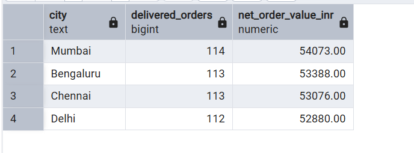
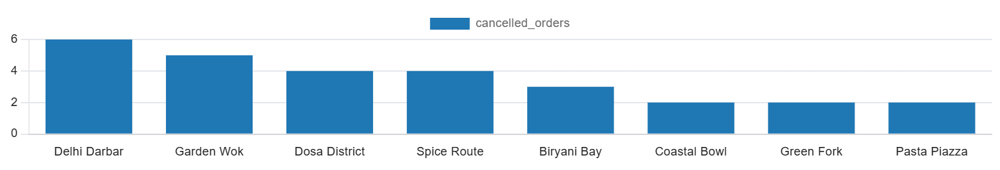
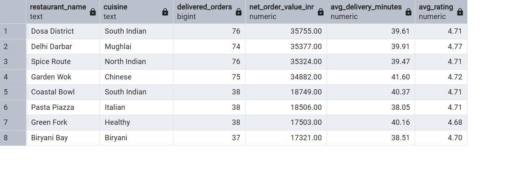

# Food Delivery Data Warehouse

A PostgreSQL portfolio project that turns operational food-delivery records into an analytics-ready star schema. It demonstrates dimensional modeling, repeatable ETL, KPI reporting, delivery operations analysis, and customer cohort retention.

## What this project answers

- How are orders, gross merchandise value (GMV), and commission changing each month?
- Which cities, restaurants, and delivery partners drive the business?
- Where are delivery delays occurring, and how does on-time performance vary?
- How well do acquired customers return in later months?

## Stack

- PostgreSQL 14+ (the scripts use `generate_series` and `date_trunc`)
- SQL only — no external data or application is required

## Quick start

Run these files in order from `psql` or your SQL client:

```sql
\i schema.sql
\i seed_data.sql
\i etl.sql
\i queries/01_exploration.sql
```

The seed file creates 480 realistic synthetic orders from January through June 2025. Re-running `etl.sql` is safe: it rebuilds the warehouse tables from the raw layer.

## Model

`fact_order` is the central fact table at **one row per order**. It joins to date, customer, restaurant, delivery-partner, location, and order-status dimensions. Money is stored in INR.

```text
dim_date        dim_customer       dim_restaurant
     \                |                   /
      \               |                  /
       ----------- fact_order -----------
              /          |         \
  dim_location  dim_delivery_partner  dim_order_status
```

## Files

- `schema.sql` — raw operational tables and star-schema tables
- `seed_data.sql` — deterministic synthetic source data
- `etl.sql` — idempotent full-refresh transformation
- `queries/` — exploration, KPI, delivery, and cohort analysis
- `data_dictionary.md` — business definitions and table reference

## Screenshots

1. Orders and net order value by city.


2. Restaurants with the most cancelled orders.


3. Check warehouse grain and delivery coverage.


4. Restaurant performance with a minimum volume threshold.



